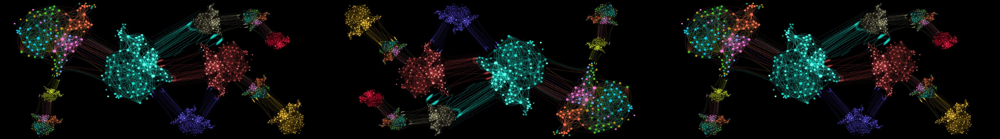
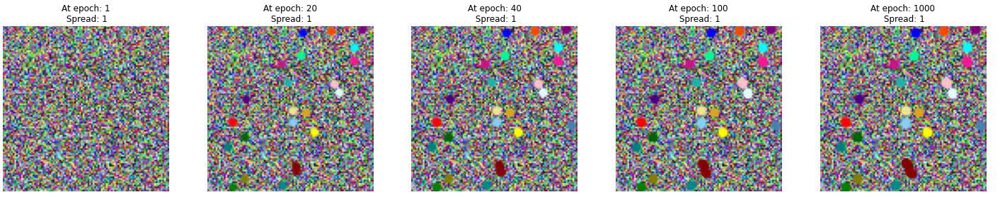
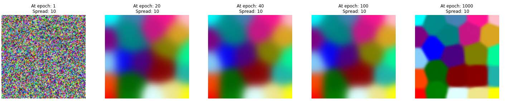
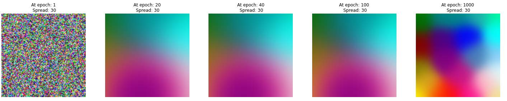
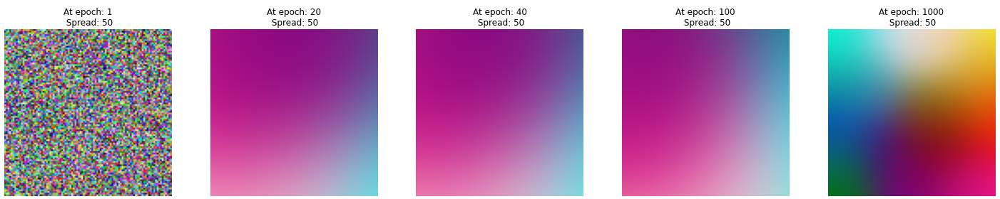
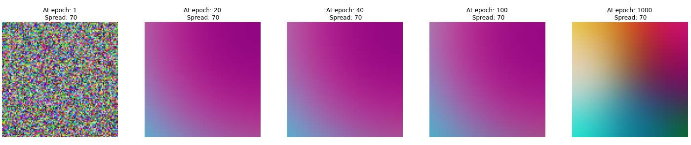

<!-- Reference:
https://github.com/othneildrew/Best-README-Template -->

<!-- PROJECT LOGO -->
 

  <h1 align="center"><i> Clust-Reduce </i></h1>

  
  
  

    A custom Kohenen Self-Organising Map for clustering inputs and reducing dimensionality of the input space !
  

 

<!-- TABLE OF CONTENTS -->

  
Table of Contents

  <ol>
    <li>
      <a href="#about-the-project">About The Project</a>
    </li>
    <li>
      <a href="#getting-started">Getting Started</a>
    </li>
    <li><a href="#case-study-analysis">Case Study Analysis</a></li>
    <li><a href="#license-or-author">License or Author</a></li>
    <li><a href="#contact">Contact</a></li>
    <li><a href="#acknowledgments">Acknowledgments</a></li>
  </ol>

 

<!-- ABOUT THE PROJECT -->
## About The Project
  ClustReduce is a Recurrent Neural Network based on Kohenen's Self-organising map architecture. In this project, we have created a custom network from scratch, which can be utilized for different parameter configurations and varying data domains.

  We also analysed the network for RGB inputs, the results of which can be found in one of the below sections.

  
(<a href="#readme-top">back to top</a>)

## Built With
  &nbsp; &nbsp; &nbsp;  &nbsp; &nbsp;

  &nbsp; &nbsp; &nbsp; <b><i> Python</i></b>

  
(<a href="#readme-top">back to top</a>)

<!-- GETTING STARTED -->
## Getting Started
  #### Prerequisites
  * Python
  * MatPlotLib
  * Numpy
  * Pandas

  #### Installation & Use
  1. Get ClustReduce.py
  2. Import KSOM in your implementation
  3. Use the functions as per your convinience and configuration.

  
(<a href="#readme-top">back to top</a>)

<!-- USAGE EXAMPLES -->
## Case Study Analysis
  We tried ClustReduce on random RGB color data over a 100 x 100 map size. The input included a sparse color domain consisting of multiple occurences of 24 unique RGB combinations. The detailed report can be found in Report.pdf in the parent directory.

  Following were the clustering results in a 100 x 100 reduced space:
  * Spread = 1:
    

  * Spread = 10:
    

  * Spread = 30:
    

  * Spread = 50:
    

  * Spread = 70:
    

  #### Observations
  * With a low spread value of ‘1’, the network is able to form small clusters with well-formed boundaries in as low as 20 epochs.
    - The clusters are very small, as is expected – due to the smaller neighbourhood size.
    - We can look at it as a case of strong specialization (even at a low number of epochs).
  * With Spread = 10, we see good boundaries forming - from 20 epoch onwards, and these boundaries become more clear at epoch=1000.
    - The clusters still maintain a good amount of specialization of colors, at epoch = 1000.
  * As we further increase the values of spread, we observe that the network takes longer to form clusters with clear boundaries.
    - The clusters are also larger in size due to a bigger neighbourhood.
    - We can say that the clusters are more generalized, representing a larger sample space.
  * A similar trend continues as we keep increasing the value of spread. In fact, at spread values ‘50’ and ‘70’, we can hardly make out any clear boundaries.

  #### Conclusion
  From these observations, we can draw the following conclusions:
  * With lower spread values, we achieve clear boundaries in less number of epochs, forming small specialized
clusters.
  * With each increase in spread value, we move towards generalization, as we achieve comparatively bigger
clusters, representing a larger sample space.
    - But note that, if we run the network for relatively more number of epochs (E.g. 2000, 3000, etc), we will move towards more specialized clusters, as the neighbourhood parameter would also go down with each new epoch.

  
(<a href="#readme-top">back to top</a>)

<!-- LICENSE -->
## License or Author
  * Authored by Uditya Laad, Himalaya Sharma, Dakota Wang - University of Waterloo
  * <b> Case Study</b> : Suggested By Prof. Hatham Amar - University of Waterloo

  
(<a href="#readme-top">back to top</a>)

<!-- CONTACT -->
## Contact
  <b>Uditya Laad</b> &nbsp; [@linkedin.com/in/uditya-laad-222680148](https://www.linkedin.com/in/uditya-laad-222680148/)
  
  &nbsp; &nbsp; &nbsp; &nbsp; &nbsp; &nbsp; &nbsp; &nbsp; &nbsp; &nbsp; &nbsp; &nbsp; [@github.com/udityalaad](https://github.com/udityalaad)
  
  &nbsp; &nbsp; &nbsp; &nbsp; &nbsp; &nbsp; &nbsp; &nbsp; &nbsp; &nbsp; &nbsp; &nbsp; udityalaad123@gmail.com

  <b>Project Link</b> &nbsp; [https://github.com/udityalaad/Clust_Reduce](https://github.com/udityalaad/Clust_Reduce)

  
(<a href="#readme-top">back to top</a>)

<!-- ACKNOWLEDGMENTS -->
## Acknowledgments
  * ECE 657, Assignment 2, Hatham Amar, University of Waterloo, Waterloo, ON, CA
  * [github.com/othneildrew/Best-README-Template/](https://github.com/othneildrew/Best-README-Template)

  
(<a href="#readme-top">back to top</a>)

